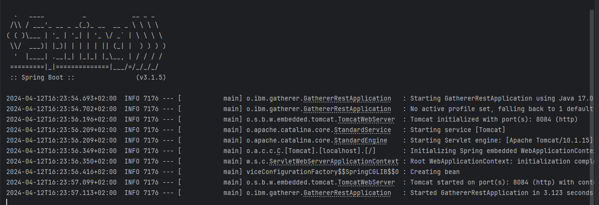
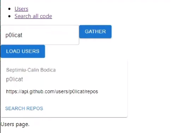
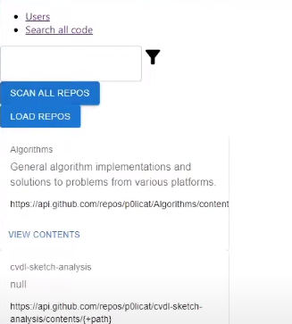
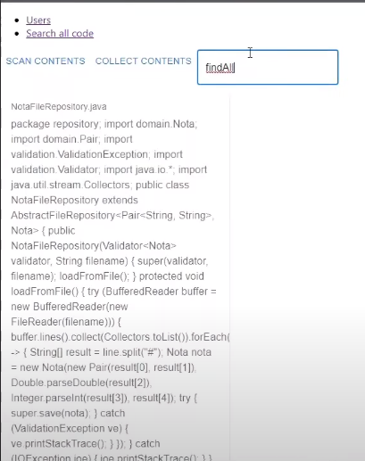

# vcs-query-tool

Full stack application to crawl the source code of repositories.

Framework written in #Java which eases management of multiple VCS.

The data is stored by JPA as a Schema containing encoded contents of the files, and can be further used by syntax analyzers, which was the original purpose of the project.

# Background

Building a backend in Java involves using libraries and frameworks which have been around for some time. I had no prior experience developing java in Eclipse so I was able to learn a more detailed way of configuring and managing projects using Maven in Eclipse.

This project uses Spring, JPA, Spring Boot, and other frameworks, which can be seen in the pom.xml dependencies. The design approach was to use as many styles of programming as possible in order to reuse them later on.

# Deployment

Maven was used with Java EE 11, built with IBM Semeru Runtimes, which are based on OpenJDK class libraries and the Eclipse OpenJ9 JVM. Projects are created by Eclipse IDE. Database configured is MS SQL Server 2018. For the tests the h2 in-memory db was used.
